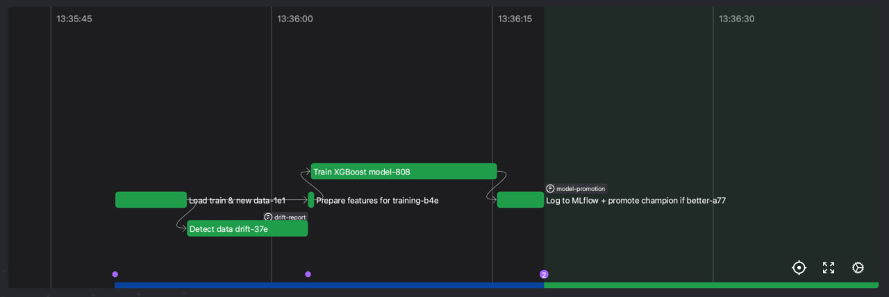

# Auto-Retraining Gradient Boosting Pipeline

End-to-end pipeline for periodic retraining of a gradient boosting model with:
- data drift detection (Evidently)
- experiment tracking and model registry (MLflow)
- orchestration (Prefect 2)
- PostgreSQL storage for training data and incoming data


## What’s inside
- `src/consumer`: reads `data/inference.zip` and writes raw rows to `new_data`
- `src/data_processing`: feature engineering + validation, moves rows into `train`
- `src/retraining`: Prefect flow that detects drift, trains XGBoost, logs to MLflow, and promotes the best model
- `src/database`: DB helpers and schema
- `models/`: baseline model artifact

## Quick start (Docker Compose)

1. Create `.env` (or use defaults):
```
PG_DB=mlops
PG_USER=mlops
PG_PASSWORD=mlops

EXPERIMENT_NAME=xgb-retrain
MODEL_NAME=xgb-model
```

2. Build and start core services:
```
docker compose up --build db mlflow prefect
```

3. Ingest raw data to `new_data`:
```
docker compose up --build consumer
```

4. Log the first model into MLflow:
```
docker compose run --rm bootstrap_mlflow
```

5. Run the retraining flow once:
```
docker compose run --rm retraining
```

## UIs
- Prefect: `http://localhost:4200`
- MLflow: `http://localhost:5001`


## Environment variables
Required for DB and tracking:
- `PG_DB`, `PG_USER`, `PG_PASSWORD`, `PG_HOST`, `PG_PORT`
- `EXPERIMENT_NAME`, `MODEL_NAME`
- `MLFLOW_TRACKING_URI` (default in compose: `http://mlflow:5001`)
- `PREFECT_API_URL` (default in compose: `http://prefect:4200/api`)
- `MODEL_PATH` (optional, overrides `models/model.ubj`)

## Notes
- `consumer` reads `data/inference.zip` from the repo and writes to `new_data`.
- Feature engineering also validates rows before moving them to `train`.
- MLflow uses a local SQLite backend inside the container volume.

## Troubleshooting
- If MLflow returns `Invalid Host header`, ensure `MLFLOW_SERVER_ALLOWED_HOSTS` is set in `docker-compose.yml`.
- If Prefect errors with client/server version mismatch, rebuild `retraining` (it pins Prefect 2.20.18).

